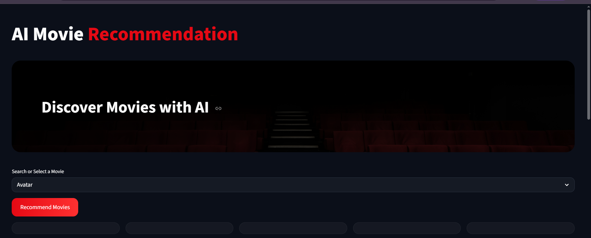
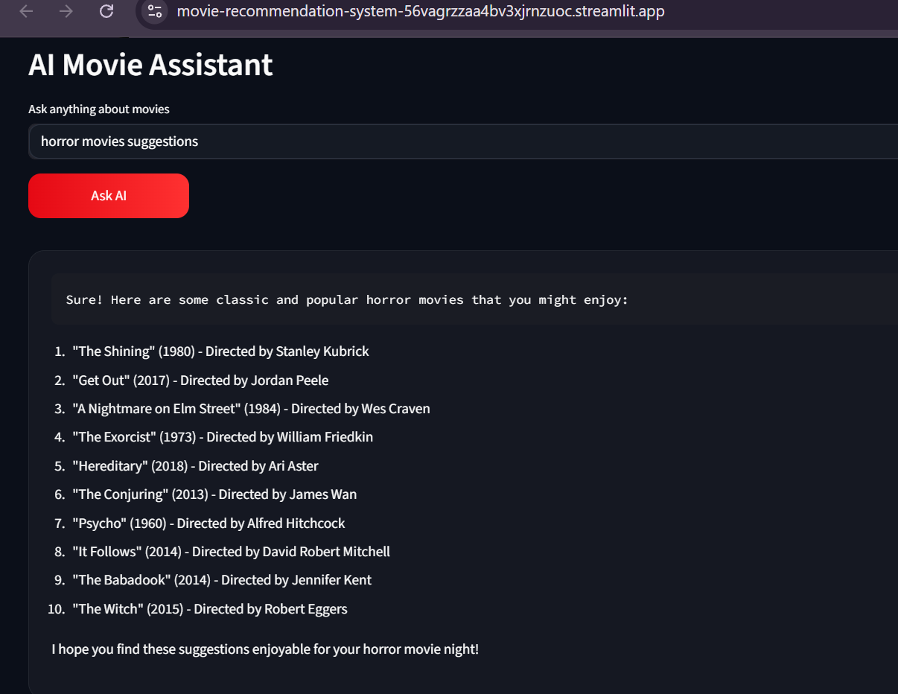
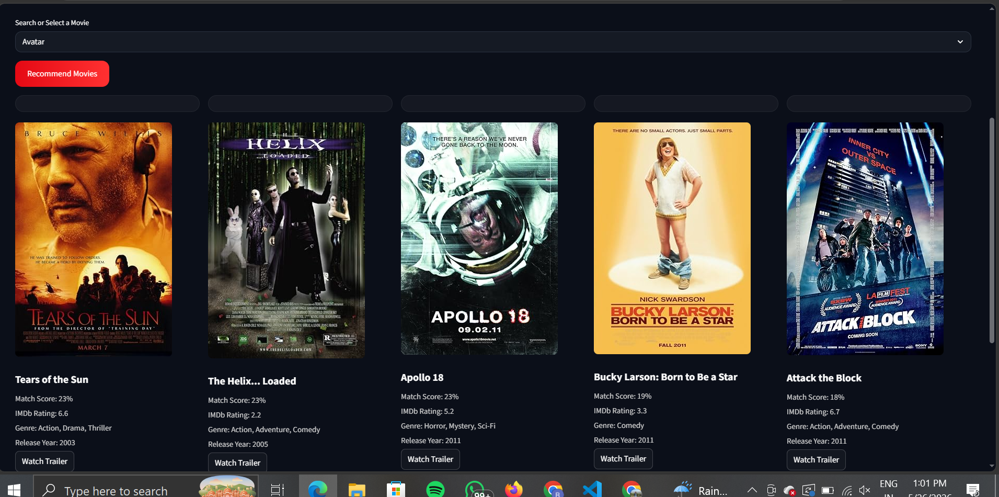

# AI Movie Recommendation System

An AI-powered Movie Recommendation Web Application built using Streamlit, Machine Learning, OpenRouter API, and OMDB API with a modern cinematic UI.

---

## Live Demo

https://movie-recommendation-system-56vagrzzaa4bv3xjrnzuoc.streamlit.app/

---

## Features

* AI-powered movie recommendations
* AI Movie Assistant chatbot
* Movie posters, ratings, genres, and release year
* Modern Netflix-inspired dark UI
* OMDB API integration
* Responsive Streamlit deployment
* Fast recommendation system without heavy similarity matrix deployment

---

## Tech Stack

* Python
* Streamlit
* Pandas
* Scikit-learn
* OpenRouter API
* OMDB API
* HTML & CSS

---

## Installation

Clone the repository:

```bash
git clone https://github.com/Riticaa/Movie-Recommendation-System.git
```

Go to project directory:

```bash
cd Movie-Recommendation-System
```

Install dependencies:

```bash
pip install -r requirements.txt
```

Run the application:

```bash
streamlit run app.py
```

---

## Environment Variables

Create a `.streamlit/secrets.toml` file and add:

```toml
OPENROUTER_API_KEY = "your_api_key"
OMDB_API_KEY = "your_api_key"
```

---

## Project Structure

```bash
Movie-Recommendation-System/
│
├── app.py
├── requirements.txt
├── README.md
├── movie_list.pkl
├── movies_dict.pkl
├── data/
├── notebooks/
└── screenshots/
```

---

## Screenshots

### Home Page



---

### AI Chat Assistant




---

### Movie Recommendations




---

## Future Enhancements

* Voice Search
* Personalized Watchlist
* Trailer Integration
* Advanced AI Recommendation Engine
* User Profile System
* Firebase Authentication
* Login Interface
---

## Author

### Ritica Awasthi

GitHub: https://github.com/Riticaa

---

## License

This project is developed for educational and learning purposes.
